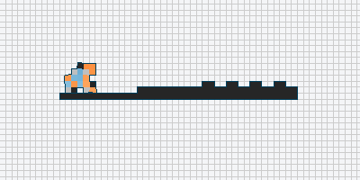

# Yet Another Soft Robot Evolver

This repository uses [Evolution Gym](https://evolutiongym.github.io)
as a base to play with evolutionary computation algorithms and other
weirder things.

It can also be useful as a minimalist codebase to learn how to use
evogym without having to worry about PPO and stuff.

## Files
- `test/`: contains a script to test if your Evogym installation is working

- `docs/`: contains some documentation to learn about Evolutionary Computation

- `Search.py`: uses simple search algorithms to optimize the robot body 
for a given task. Random Search, GA and ES are implemented. Use `python 
Search.py -h` for options.

- `Visualize.py`: Visualizes the result of one robot running on one 
world file (note: it does not need to be the same ones that ran together 
originally!). Use `python Visualize -h` for options.

- `robot/`: Contains objects implementing evolving robots.

- `world/`: COntains objects implementing worlds and tasks.

- `TODO.md`: hell.

- `README.md`: guess.

## How to Install:
- Create a local python 3.10 environment using pyenv or similar
- Install evogym: `pip install evogym --upgrade` (See evogym repository for details)
- Install linux dependencies (for evogym): `sudo apt install xorg-dev libglu1-mesa-dev`
- Install python dependencies (for evogym): `pip install glfw PyOpenGL ttkbootstrap` 
- Install python dependencies (for this repo): `pip install pygifsicle imageio`

## About
- This repository was created by [Claus Aranha](https://conclave.cs.tsukuba.ac.jp)
